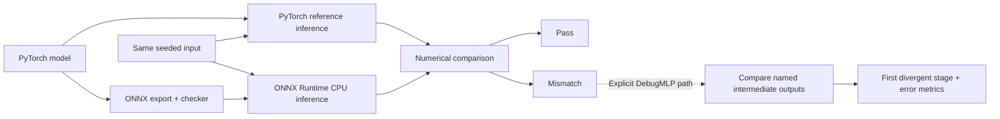

# inference-validation-lab

A small CPU inference lab for checking that an exported model preserves numerical
behavior. PyTorch is the reference; ONNX Runtime executes the ONNX graph as the
independent target. The package compares outputs, localizes mismatches at named
debug stages, and measures inference latency and throughput.



## Models and graphs

Models use seeded random weights, float32 inputs, and four output values per
sample. They are validation fixtures, not trained classifiers.

| Model | Input shape | PyTorch stages |
| --- | --- | --- |
| `MLP` | `[batch, 16]` | Linear 16→32 → ReLU → Linear 32→4 |
| `CNN` | `[batch, 1, 8, 8]` | Conv2d 1→4 (3×3, padding 1) → ReLU → MaxPool2d 2 → Flatten → Linear 64→4 |
| `DebugMLP` | `[batch, 16]` | `linear_1` 16→32 → `relu_1` → `linear_2` 32→32 → `relu_2` → `linear_3` 32→4 |

ONNX operator families are `Gemm → Relu → Gemm` for the MLP and
`Conv → Relu → MaxPool → Flatten/Reshape → Gemm` for the CNN. Exporter versions
may represent a linear layer as `MatMul + Add`; `inspect_graph()` reports the
actual stored operators, tensor names, shapes, and dtypes.

Normal export uses `torch.onnx.export(dynamo=True)`, names tensors `input` and
`output`, embeds weights in one file, and runs ONNX's checker. Only batch size is
dynamic. Export needs a representative batch of at least two; inference supports
batch size one. Both runners accept a `torch.Tensor` and return a NumPy array.

## Setup and commands

From the repository root, with Python 3.10+ and compatible dependency wheels.
These commands use Windows PowerShell and an explicit virtual-environment Python;
no activation is needed.

```powershell
python -m venv .venv
.venv\Scripts\python.exe -m pip install torch --index-url https://download.pytorch.org/whl/cpu
.venv\Scripts\python.exe -m pip install -e ".[test,plots]"
.venv\Scripts\python.exe -m pytest -q
```

The `plots` extra supplies matplotlib; it is unnecessary for validation alone.
Run the benchmark table and regenerate both README plots in one execution:

```powershell
.venv\Scripts\python.exe scripts/benchmark.py --plots
```

Omit `--plots` for the table only. The script covers MLP/CNN × PyTorch/ONNX Runtime
× batch sizes 1, 8, 32. Both plots use that same run's measured results.

Graph inspection and localization are **library APIs**, not separate CLIs. Run
the following in the environment's Python interpreter (`.venv\Scripts\python.exe`)
to inspect a normal MLP graph and compare all `DebugMLP` activations:

```python
from pathlib import Path
from tempfile import TemporaryDirectory

from inference_validation.deterministic import generate_input, set_seed
from inference_validation.models import MLP, DebugMLP
from inference_validation.onnx_export import export_onnx, inspect_graph
from inference_validation.localization import (
    ONNXDebugRunner, export_debug_onnx, pytorch_activations,
    localize_divergence, print_localization,
)

set_seed(42)
inputs = generate_input(8, seed=42)
with TemporaryDirectory() as directory:
    root = Path(directory)
    path = export_onnx(MLP(), inputs, root / "mlp.onnx")
    print(inspect_graph(path))

    model = DebugMLP()
    path = export_debug_onnx(model, inputs, root / "debug.onnx")
    reference = pytorch_activations(model, inputs)
    target = ONNXDebugRunner(path).run(inputs)
    print_localization(localize_divergence(reference, target))
```

The clean example prints `Validation passed`. A mismatch prints the first stage,
maximum/mean absolute error, and count outside tolerance. Tests inject faults only
into captured target activations; normal inference contains no fault injection.

## Validation methodology

- `set_seed()` seeds model initialization; `generate_input()` uses a local seeded
  CPU generator. PyTorch runs in evaluation mode under `torch.no_grad()`;
  ONNX Runtime uses `CPUExecutionProvider` with the same logical inputs.
- `compare_outputs()` requires `abs(target - reference) <= atol + rtol * abs(reference)`
  at every value, with defaults `atol=1e-6`, `rtol=1e-5`. Shapes must match exactly.
  It returns pass/fail, max/mean absolute error, max relative error, outside-tolerance
  count, and NaN/Inf counts across both arrays. Any nonfinite pair fails and
  contributes infinite error. At a zero reference, relative error is zero for an
  exact match and infinity otherwise; absolute tolerance still governs passing.
- `localize_divergence()` compares named activations in reference execution order
  and returns the earliest failure with its `ComparisonResult`. Debug export
  explicitly exposes each stage as an output; normal export stays single-output.
  This is stage localization for `DebugMLP`, not automatic mapping of arbitrary
  ONNX operators back to PyTorch layers.
- Pytest covers deterministic PyTorch inference, checked ONNX graphs and metadata,
  MLP/CNN agreement at batches **1, 2, 8, 32**, clean debug batches **1 and 8**,
  tolerance/nonfinite cases, and earliest-fault detection. Benchmark statistics
  use synthetic clock tests, never speed assertions or timing thresholds.

## Example CPU measurements

The plots below are **one example local CPU run**, not universal backend performance
claims. Regeneration repeats the procedure, not exact timings: hardware, package
versions, thread defaults, and system load affect measurements. These measurements
do not establish the cause of backend differences.

Included figures were generated on Windows x86-64 with Python 3.14.2,
PyTorch 2.14.0+cpu, ONNX 1.22.0, ONNX Runtime 1.30.0, and matplotlib 3.11.2.

The script uses seed 42, **5 warm-up calls and 30 measured calls** per configuration,
with backend default thread settings. Models export once and ONNX sessions are
reused across batches. Export, session/model setup, input generation, warm-up, and
plotting are outside timing. Each timed call includes the runner's input/output
conversion. `perf_counter_ns()` measures synchronous wall-clock latency.

`benchmark()` returns median/mean/min/max latency and population standard deviation
in seconds, batch size, measured iteration count, and throughput computed as
`batch_size * measured_iterations / total_measured_seconds`. The table/plots display
latency in milliseconds. The reusable API allows other warm-up and iteration counts.


## Repository layout

```text
src/inference_validation/
  models.py                 # MLP, CNN, DebugMLP
  deterministic.py          # Seeds and CPU inputs
  pytorch_runner.py         # Reference execution
  onnx_export.py            # Normal export and graph inspection
  onnx_runner.py            # Target execution
  comparison.py             # Numerical metrics and tolerances
  localization.py           # Explicit debug export and stage comparison
  benchmark.py              # Backend-independent timing
scripts/benchmark.py        # Comparison table and optional plots
tests/                      # Automated correctness and timing-logic tests
docs/images/                # Generated benchmark figures
pyproject.toml              # Package, dependencies, pytest configuration
```

## V1 scope

CPU-only, small float32 models with fixed feature/spatial dimensions and a dynamic
batch axis. Reproducibility is checked within an environment, not promised bitwise
across hardware or dependency versions. V1 does not cover real accelerator hardware,
CUDA/GPU execution, quantization, large production models, or hardware profiling.
